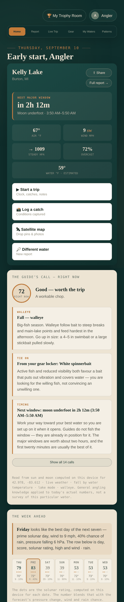
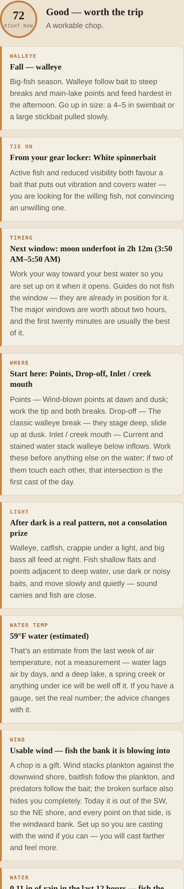
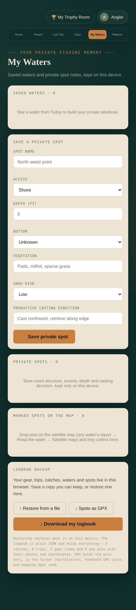

# Fishing Almanac

An installable fishing app that runs entirely in a browser. Open it on a phone,
tap **Add to Home Screen**, and it becomes a real full-screen app with its own
icon — no app store, no developer account, no Mac.

It opens on the water you are actually standing next to, tells you when the next
feeding window is, reads the live conditions, and says what a guide would say
about them right now.

<p align="center">
  
  &nbsp;
  
  &nbsp;
  
</p>

## What it does

**Opens on the water you're on.** It takes a GPS fix, asks OpenStreetMap what
water is around that point, and loads the nearest named lake or river. No typing,
no list of places. The water you are literally standing beside outranks a pond
whose centre happens to be closer.

**Tells you when.** Sunrise, sunset, moonrise, moonset and the solunar major and
minor feeding windows, computed on the device with a full Meeus solar and lunar
solution — verified to within three seconds of a reference implementation. It
works offline, anywhere in the world, at any latitude.

**Tells you what to do about it.** An advice engine reads the season for your
latitude, the light phase from computed twilight, barometric trend, wind speed
*and direction*, cloud, rain in the last twelve hours, water temperature, how far
off the next window is, lake versus river, the species you're after, the lures in
your gear locker, and your own catch log — and issues up to fifteen prioritised
calls, each with the reasoning behind it. Safety outranks everything: a
thunderstorm or a 25 mph wind is the first thing it says.

**Tells you which day.** All seven days ahead are scored and the best one named,
blending the device's own solunar rating for each date with the forecast's
pressure change, wind and rain.

**Knows the water temperature**, which is what actually runs fish. Estimated from
the past week of air temperature and clearly labelled as an estimate — and you
can type your own reading over it. At 47°F it stops saying "autumn" and starts
saying walleye are sitting in their spawn band.

**Real satellite maps** of the actual water, with pins you drop on the true
shoreline. Attach a photo to any pin, or tick one box when logging a catch and
it's filed at the GPS coordinates you caught it at. Cache the tiles before you
lose signal.

**Learns you.** Every catch records the real conditions at that moment — moon,
pressure trend, temperature, wind, sky. After a handful of fish the Patterns page
stops giving general advice and starts giving yours, with the sample size printed
next to every claim.

**Gets your data out.** A JSON logbook with everything in it, and GPX export so
the spots you marked on your phone load onto a chartplotter, a handheld GPS or
any mapping app.

Full feature list and the on-the-water instructions: **[docs/USING-THE-APP.md](docs/USING-THE-APP.md)**.

## Running it

It is static files. Serve them over HTTPS and that's the whole deployment — GPS
and the satellite tiles both refuse to work otherwise, and a PWA cannot be
installed from a `file://` URL.

**GitHub Pages** — this repo publishes itself. Set Settings → Pages → Source to
**GitHub Actions** and every push to `main` deploys. Your link is
`https://<you>.github.io/<repo>/`. (Pages on a free account needs the repo to be
public; a private repo needs Pro or above.)

**Locally**, from the repo root:

```sh
python3 -m http.server 8080
# then open http://localhost:8080
```

localhost counts as a secure origin, so GPS, the service worker and installation
all work there.

**Anywhere else** — Netlify Drop, tiiny.host, Cloudflare Pages, an S3 bucket.
There is no build step and no server.

## Installing it on a phone

- **Android (Chrome):** open the link → menu (⋮) → **Add to Home screen**.
- **iPhone (Safari):** open the link → Share → **Add to Home Screen**. It must be
  Safari; iOS only installs PWAs from there.

The first launch asks for location. Allow it and the app opens on the water
nearest you; decline and everything still works, you just type the name.

## What leaves the device

| What | Where it goes |
| --- | --- |
| Sun, moon, twilight, solunar windows | Nowhere. Computed on the device, works with no signal. |
| Naming the water near you | An approximate position goes to **OpenStreetMap** (Overpass). |
| Live weather and the forecast | The water's coordinates go to **Open-Meteo** (keyless). |
| Satellite imagery | Tiles come from **Esri World Imagery** (keyless). |
| Catches, trips, gear, notes, pins, photos | Nowhere. `localStorage` on that device only. |

There is no account, no server, no analytics and no telemetry. Nothing is
uploaded. The trade-offs above are stated inside the app too, on the panel that
makes each request.

## How it is built

No framework, no build step, no bundler — one `app.js`, one `style.css`, one
`index.html`. Leaflet is the only runtime dependency, and it comes from a CDN.

- **Rendering** is a single `state` object and a `render()` that replaces
  `innerHTML`, with event delegation on `data-action`. Inputs marked `data-bind`
  write straight into state *without* re-rendering, so typing never loses the
  caret.
- **Astronomy** (`app.js`, top) is Meeus's solar and abbreviated lunar series
  with ΔT, IAU sidereal constants and iterative rise/set refinement. It was
  checked against an independent implementation; worst error across a year is
  about three seconds.
- **The map** is Leaflet over Esri World Imagery. Markers live in their own
  registry, never on the pin objects, because a Leaflet marker holds a reference
  back to the map and `JSON.stringify` would choke on the cycle.
- **Offline** is a service worker: cache-first for the app shell, network-first
  for map tiles with an opportunistic cache, so water you have already looked at
  stays visible without a signal.
- **Storage** is `localStorage` throughout, in canonical imperial units,
  converted only at display time. Photos are the only thing large enough to fill
  a browser's quota, so every write that could fail is reverted rather than left
  half-applied, and the app says so plainly.

## Tests

Four end-to-end suites drive the real app in a real browser. Leaflet, the tile
server, Open-Meteo, Overpass and the GPS are stubbed — everything else is the
shipping code.

```sh
cd tests
npm install
npx playwright install chromium
npm test
```

| Suite | Covers |
| --- | --- |
| `app.test.js` | Dashboard, the guide's calls, map pins, pin photos, notes, catch logging |
| `edges.test.js` | No weather, a live feeding window, southern-hemisphere seasons, GPS-pinned catches, storage exhaustion |
| `nearby.test.js` | The launch sequence: GPS, nearest water, water-you're-standing-on ranking, Overpass down, GPS denied |
| `tools.test.js` | Water temperature and its override, the week ahead, personal patterns, GPX, backup and restore, sharing |

They also run on every push and pull request — see
[`.github/workflows/tests.yml`](.github/workflows/tests.yml).

`npm run screenshots` regenerates the images in `docs/screenshots`.

## An honest note on what this knows

The habitat guides and the guide's calls are general angling knowledge applied to
today's actual numbers. They are not a survey of your particular water — no such
dataset exists for most waters, and the app does not pretend otherwise anywhere
in its interface.

The water temperature is an estimate from air temperature unless you measure it.
Weather more than three days out is a guess, and the week-ahead scores inherit
that. The solunar windows are an angling convention, not a forecast.

The part that is genuinely, specifically yours is the pins you drop and the
catches you log. That is the part no dataset can give you, and it is the part the
app works hardest to keep.

## Licence

MIT — see [LICENSE](LICENSE).

Imagery is © Esri, Maxar and Earthstar Geographics under Esri's terms. Water
names come from OpenStreetMap contributors, ODbL. Weather is from Open-Meteo
(CC BY 4.0). Leaflet is BSD-2-Clause.
